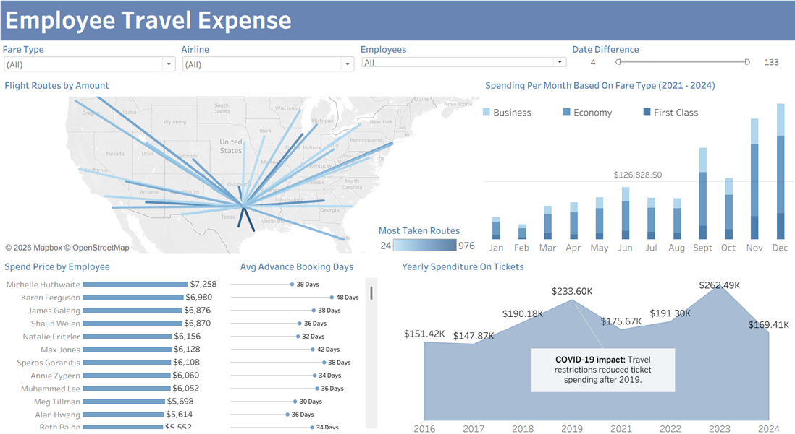
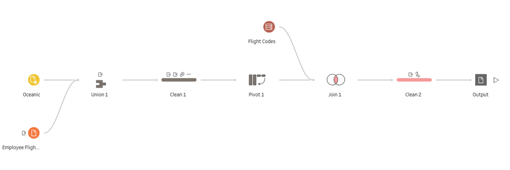

# Employee Travel Expense Dashboard

An interactive business intelligence dashboard built in **Tableau** for analysing employee travel expenses at **Axiom Inc.**

The project focuses on helping a **Finance Office Manager** monitor ticket spend, booking behaviour, fare types, employee travel patterns, and high-frequency routes.

> This dashboard supports travel cost control by linking spend to booking lead time, fare selection, traveller behaviour, and route concentration.

---

## 🔗 Live Dashboard

[View on Tableau Public](https://public.tableau.com/app/profile/alex.kavanagh/viz/CA_Visualisation_20098349/EmployeeTravelExpense)

---

## 📸 Dashboard Preview

---

## 🧹 Prep Builder Preview

---

## 📌 Project Scenario

Axiom Inc. monitors employee business travel to control costs while still allowing necessary travel. The dashboard was created for the **Finance Office Manager**, whose role is to review travel-related expenses, identify spending patterns, and report findings to senior management.

The main goal of the dashboard is to make it easier to identify where avoidable travel costs may be reduced through better booking habits, improved route planning, and stronger fare type control.

---

## 🎯 Key KPIs

| KPI | Purpose | How It Is Measured |
|---|---|---|
| **Purchase Lead Time** | Shows how far in advance trips are booked | Average and median days between `Purchase Date` and `Travel Date` |
| **Travel Frequency** | Identifies frequent travellers and travel-heavy routes | Trips per employee, frequency bands, and route counts |
| **Ticket Spend** | Tracks overall cost behaviour | Total ticket price by employee, route, month, year, airline, and fare type |

---

## ⚙️ Dashboard Interactivity

| Feature | How to Use | Effect |
|---|---|---|
| **Fare Type Filter** | Select Economy, Business, or First Class | Filters charts by ticket class |
| **Airline Filter** | Select an airline | Reviews spend and route behaviour for specific carriers |
| **Employee Filter** | Select one or more employees | Focuses the dashboard on specific travellers |
| **Date Difference Filter** | Adjust the booking lead time range | Identifies short-notice and advance booking patterns |
| **Top N Parameter** | Choose All, Top 10, Top 25, Top 50, or Top 100 | Controls how many high-spend employees are shown |

---

## 📊 Dashboard Visuals

| Visual | Type | Description |
|---|---|---|
| **Flight Routes by Amount** | Route Map | Shows where employee travel is concentrated across the United States |
| **Spending Per Month by Fare Type** | Stacked Bar Chart | Shows monthly ticket spend split by Economy, Business, and First Class |
| **Spend Price by Employee** | Horizontal Bar Chart | Ranks employees by total ticket spend |
| **Average Advance Booking Days** | Dot Plot / Dual Axis View | Shows average booking lead time for employees |
| **Yearly Expenditure on Tickets** | Area / Line Chart | Displays ticket spend trends across years |
| **Dashboard Filters** | Interactive Controls | Allows the Finance Office Manager to drill into employees, airlines, fare types, and lead times |

---

## 📌 Snapshot — Key Findings

| Insight | Detail |
|---|---|
| **Highest employee spend** | Michelle Huthwaite — approximately `$7,258` |
| **Notable high-spend example** | Karen Ferguson — approximately `$6,980` with `48 days` average advance booking |
| **Short lead time example** | Claudia Bergmann — approximately `$3,870` with only `12 days` average advance booking |
| **Most taken route** | Dallas to Houston |
| **Highest route frequency shown** | `976 trips` |
| **Peak yearly spend** | 2023 — approximately `$262.49K` |
| **COVID-19 impact** | Travel restrictions reduced ticket spending after 2019 |

---

## 🧠 Technical Highlights

### Lead Time Calculation

`DATEDIFF('day', [Purchase Date], [Travel Date])`

Used to calculate the number of days between ticket purchase and travel date.

### Trips Per Person

`{ FIXED [Person] : COUNT([Booking ID]) }`

Used to calculate how many bookings each traveller made.

### Top N Employee Filter

`CASE [Select Top N View]
WHEN "All" THEN "Show"
WHEN "Top 10" THEN IF RANK(SUM([Ticket Price])) <= 10 THEN "Show" ELSE "Hide" END
WHEN "Top 25" THEN IF RANK(SUM([Ticket Price])) <= 25 THEN "Show" ELSE "Hide" END
WHEN "Top 50" THEN IF RANK(SUM([Ticket Price])) <= 50 THEN "Show" ELSE "Hide" END
WHEN "Top 100" THEN IF RANK(SUM([Ticket Price])) <= 100 THEN "Show" ELSE "Hide" END
END`

This parameter lets the user control how many high-spending employees appear in the dashboard.

---

## 🧹 Data Preparation

The dataset was prepared using **Tableau Prep Builder** before being visualised in **Tableau Desktop**.

Main preparation steps included:

- Unioning multiple yearly `OceanicYear` booking files
- Combining airline booking and employee flight records
- Removing unnecessary union metadata fields
- Standardising ticket type values, such as `1st class` to `First Class`
- Cleaning inconsistent employee names
- Replacing missing airline codes with `Oceanic`
- Standardising airline names such as `AA`, `American`, and `American (AA)` to `American Airlines`
- Validating passenger email formats
- Converting travel insurance values into Boolean format
- Converting `Purchase Date` and `Travel Date` into date fields
- Creating a lead time calculation using `DATEDIFF`
- Splitting route fields into `Departure` and `Arrival`
- Joining airport reference data to support route mapping

---

## 📁 Project Structure

`EMPLOYEE_TRAVEL_EXPENSE_DASHBOARD/
├── Desktop/
│   ├── Dashboard.twbx
│   └── dashboard.png
│
├── Cleaning/
│   ├── PrepBuilder.tflx
│   └── prepbuilder.png
│
└── README.md`

---

## 🗃️ Dataset Fields

| Field | Description |
|---|---|
| `Person` | Employee traveller name |
| `Ticket Price` | Cost of the flight booking |
| `Fare Type` | Economy, Business, or First Class |
| `Airline` | Airline used for the booking |
| `Purchase Date` | Date the ticket was purchased |
| `Travel Date` | Date of travel |
| `Date Difference` | Days between purchase and travel |
| `Route` | Flight route before parsing |
| `Departure` | Departure airport code |
| `Arrival` | Arrival airport code |
| `Travel Insurance` | Boolean value showing whether insurance was included |
| `Trips Per Person` | Number of bookings per traveller |

---

## 🛠️ Tools Used

| Tool | Purpose |
|---|---|
| **Tableau Desktop** | Dashboard building and visualisation |
| **Tableau Prep Builder** | Data cleaning, transformation, joins, and unions |
| **Tableau Public** | Publishing and sharing the dashboard |
| **Microsoft Excel / CSV Files** | Source data storage |
| **VS Code** | README and project file management |
| **Git & GitHub** | Version control and project hosting |
